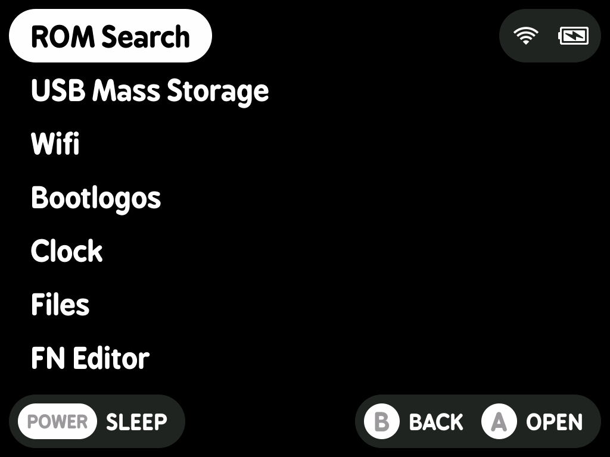
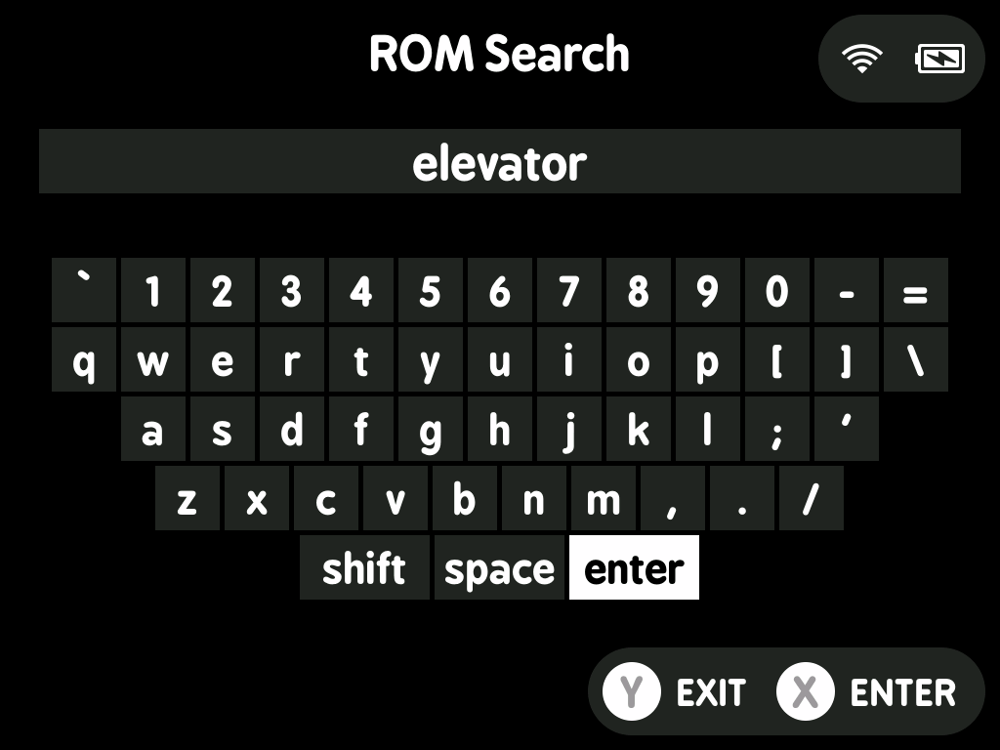
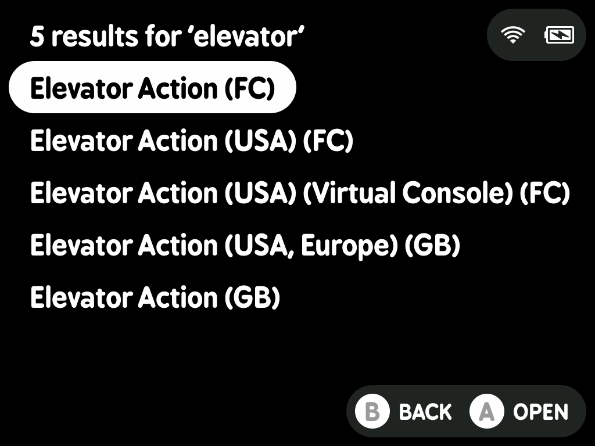

# ROM Search for MinUI

A TrimUI Brick app for searching your ROMs in the `/Roms/` directory. The app ignores anything in `/PORTS/` and `/*.disabled/` directories.

This is an early prototype, so expect some bugs. While it works well for most use cases, the initial search might be slow as it builds the cache. Subsequent searches are significantly faster.

## Installation

1. Mount your TrimUI Brick SD card.
2. [Download this repo as ZIP](https://github.com/manfromanotherland/trim-ui-rom-search/archive/refs/heads/main.zip) from GitHub.
3. Unzip and copy the `ROM Search.pak` folder to `/Tools/tg5040/ROM Search.pak` in your SD Card.

## Screenshots

| Tools | Search | Results |
| --- | --- | --- |
|  |  |  |

## TODO

- [ ] Add X button support for resuming games from save states
- [ ] Address Y button exit issue on keyboard screen (now it just clears what you typed)

## Credits

- [MinUI](https://github.com/shauninman/MinUI) by [Shaun Inman](https://github.com/shauninman)
- [minui-list](https://github.com/josegonzalez/minui-list) by [Jose Gonzalez](https://github.com/josegonzalez)
- [minui-keyboard](https://github.com/josegonzalez/minui-keyboard) by [Jose Gonzalez](https://github.com/josegonzalez)

---

> [!NOTE]
> The device directory changed from `/Tools/tg3040` to `/Tools/tg5040` in `MinUI-20250126-0` - released 2025-01-26. If you are using an older version of MinUI, use `/Tools/tg3040` instead.